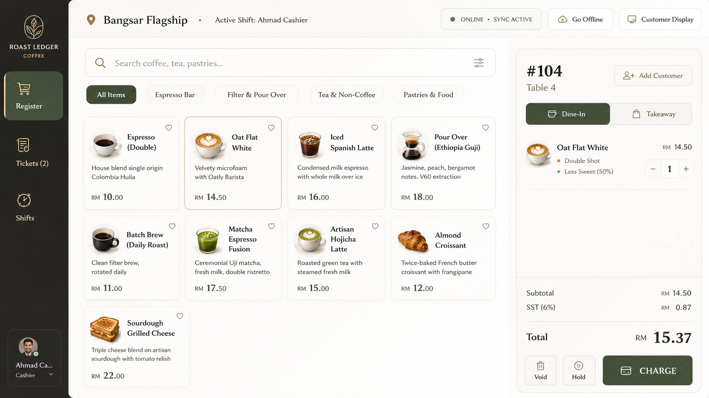
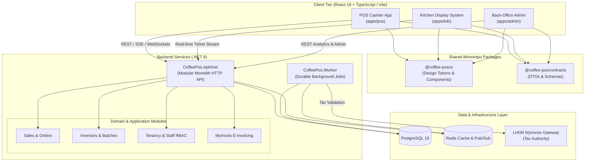
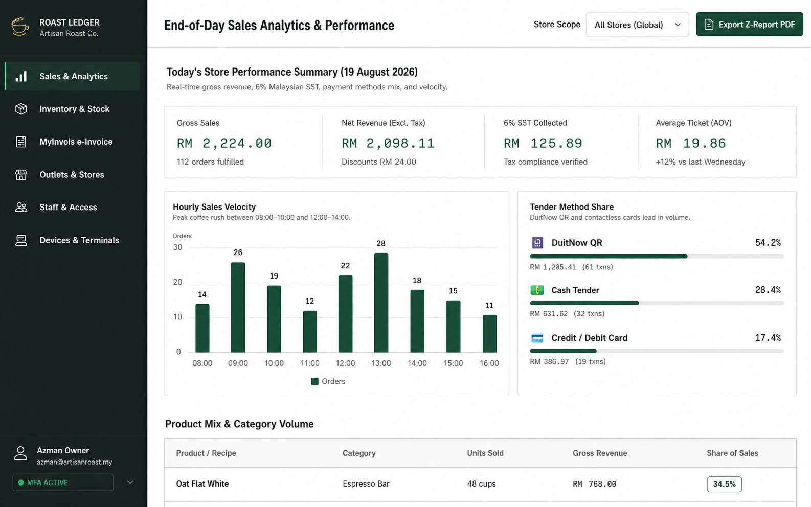
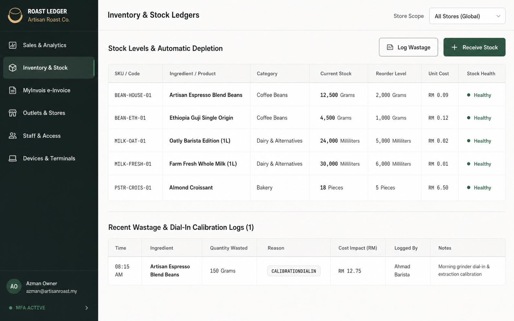
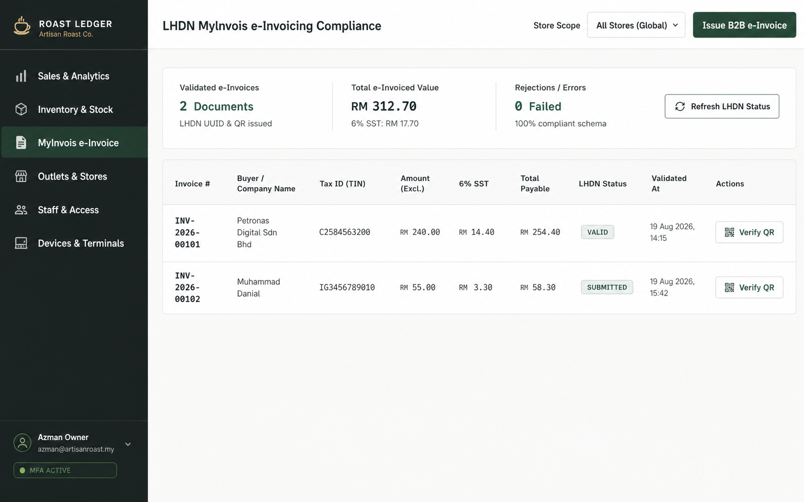
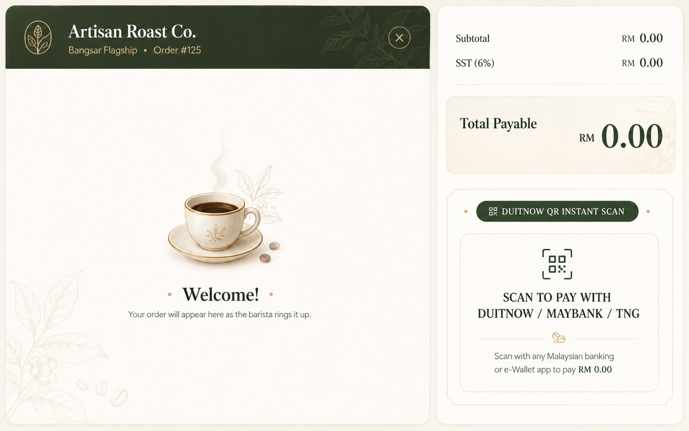

# Roast Ledger — Specialty Coffee POS & ERP Platform

<p align="center">
  
</p>

<p align="center">
  <a href="#architecture"></a>
  <a href="#tech-stack"></a>
  <a href="#tech-stack"></a>
  <a href="#tech-stack"></a>
  <a href="LICENSE"></a>
</p>

---

## Executive Overview

**Roast Ledger** is an enterprise-grade Point of Sale (POS) and Store Management system purpose-built for specialty coffee shops and multi-outlet roasteries. Built as a high-performance modular monolith with React frontends and an ASP.NET Core backend, it delivers lightning-fast cashier operations, real-time Kitchen Display Systems (KDS), multi-location inventory tracking, and full compliance with the **Malaysian LHDN MyInvois** e-invoicing mandate.

---

## System Architecture



---

## Visual Showcase

<table width="100%">
  <tr>
    <td width="50%" align="center">
      <b>Back-Office Sales & Analytics</b><br/>
      
    </td>
    <td width="50%" align="center">
      <b>Multi-Outlet Inventory & Stock Matrix</b><br/>
      
    </td>
  </tr>
  <tr>
    <td width="50%" align="center">
      <b>LHDN MyInvois E-Invoice Compliance</b><br/>
      
    </td>
    <td width="50%" align="center">
      <b>Dual Customer-Facing Display</b><br/>
      
    </td>
  </tr>
</table>

---

## Tech Stack

| Domain | Technology | Description |
| :--- | :--- | :--- |
| **Cashier & KDS UI** | React 18, TypeScript, Vite | High-speed, touch-optimized POS registers with offline caching |
| **Admin Web App** | React 18, Tailwind CSS | Back-office store configuration, sales ledger, and staff analytics |
| **Design System** | `@coffee-pos/ui` | Shared Roast Ledger tokens, accessible coffee-shop UI components |
| **Shared Contracts**| `@coffee-pos/contracts` | Strongly-typed API contracts and event schemas |
| **Backend API** | ASP.NET Core (.NET 9), C# | Modular monolith with Clean Architecture and strict boundaries |
| **Background Jobs** | .NET Worker Service | Asynchronous queue worker for stock sync, batching, and e-invoicing |
| **Relational DB** | PostgreSQL 16 | ACID-compliant transaction records, tenant isolation, and audit trails |
| **In-Memory Cache** | Redis | Session state, distributed locks, order broadcast queues |
| **E-Invoicing** | LHDN MyInvois Integration | Direct API validation and submission for Malaysian tax compliance |
| **Infrastructure** | Docker Compose, Azure Bicep | Disposable local dev stack and cloud deployment definitions |

---

## Monorepo Layout

```text
├── apps/
│   ├── pos/                 # React + TypeScript POS cashier terminal application
│   ├── admin/               # React + TypeScript back-office admin dashboard
│   └── kds/                 # Kitchen Display System for barista & food prep
├── packages/
│   ├── contracts/           # TypeScript API DTOs, schemas, and event definitions
│   └── ui/                  # Shared component library and Roast Ledger design system
├── services/
│   ├── api/                 # ASP.NET Core modular monolith backend HTTP API
│   ├── worker/              # Background queue processor and scheduled worker
│   └── CoffeePos.sln        # .NET Solution encompassing domain, application & infra
├── infra/
│   ├── docker-compose.yml   # PostgreSQL 16 and Redis development environment
│   ├── main.bicep           # Azure Infrastructure as Code template
│   └── .env.example         # Infrastructure configuration template
├── scripts/
│   ├── check-boundaries.mjs # Monorepo architectural boundary validation
│   └── check-dotnet-references.ps1
└── docs/
    ├── architecture/        # Logical architecture, threat models, and sequence diagrams
    ├── decisions/           # Architecture Decision Records (ADRs)
    ├── assets/screenshots/  # Visual reference assets and UI preview captures
    └── TASK_REGISTER.md     # Engineering phases, task tracking, and milestone gates
```

---

## Core Capabilities

- **High-Velocity Register:** Streamlined ordering workflow with single-tap modifier selections (milk alternatives, syrup pumps, bean origin, ice level).
- **Split Bills & Payment Processing:** Flexible split payments (Cash, Card, QR DuitNow, E-Wallets) with integrated receipt generation.
- **Barista Kitchen Display (KDS):** Real-time order routing categorized by drink station and kitchen prep status with latency indicators.
- **Stock & Recipe Depletion:** Automatic inventory deduction down to fractional gram and millilitre precision per espresso shot or beverage served.
- **Malaysian LHDN MyInvois Ready:** End-to-end integration for generating, signing, and submitting consolidated e-invoices with QR code verification.
- **Audit-Proof Financial Ledger:** Immutable ledger logs for shift closures, cash drawer float balancing, and refund audits.

---

## Quickstart & Local Development

### Prerequisites
- **Node.js**: `v24.x` or higher
- **npm**: `v11.x` or higher
- **.NET SDK**: `9.0` *(optional for frontend development)*
- **Docker & Docker Compose**: *(for running local PostgreSQL & Redis)*

### 1. Clone & Configure
```bash
git clone https://github.com/luqshzeeq3601-art/coffee-pos.git
cd coffee-pos

# Copy environment configuration
cp .env.example .env
```

### 2. Install Dependencies
```bash
npm install
```

### 3. Start Infrastructure (PostgreSQL + Redis)
```bash
docker compose -f infra/docker-compose.yml up -d
```

### 4. Run Frontend Applications
```bash
# Run POS Cashier Register
npm run dev --workspace=@coffee-pos/pos

# Run Admin Management Portal
npm run dev --workspace=@coffee-pos/admin

# Run Barista KDS
npm run dev --workspace=@coffee-pos/kds
```

---

## Quality Gate & Verification

The codebase enforces strict boundary checks and TypeScript validation across all workspaces:

```bash
# 1. Verify architectural boundaries (packages vs apps vs services)
npm run check:boundaries

# 2. Run TypeScript strict type-checking across all packages and applications
npm run typecheck --workspaces
```

---

## License

This project is open-source and licensed under the [MIT License](LICENSE).
