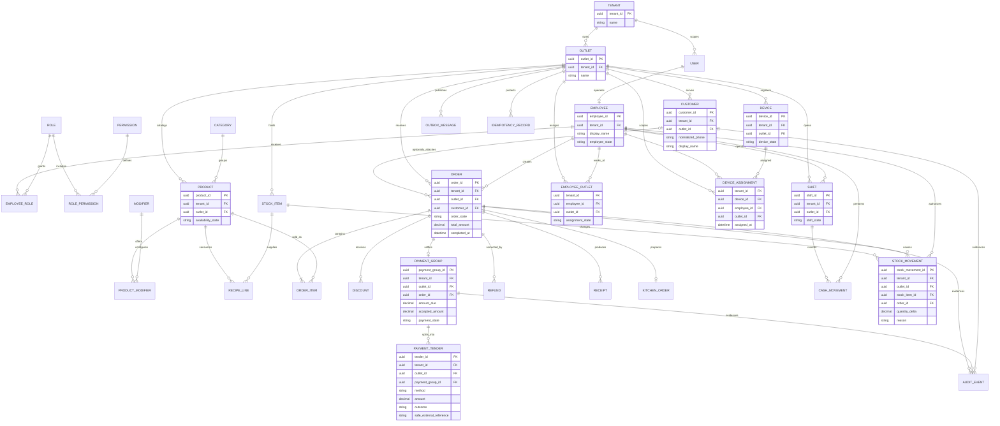
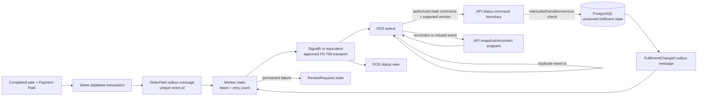
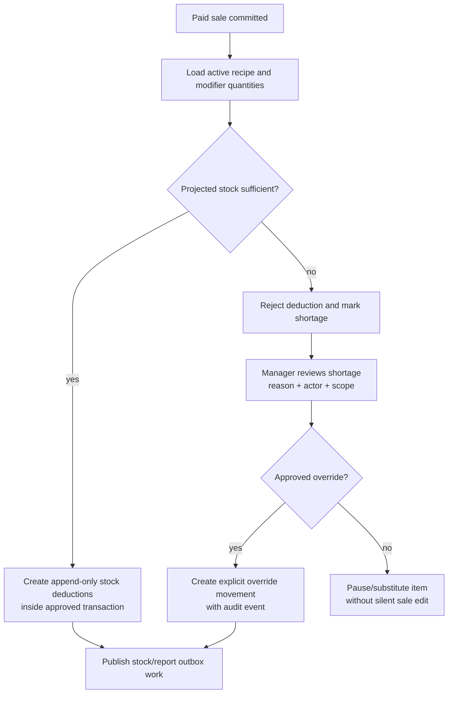
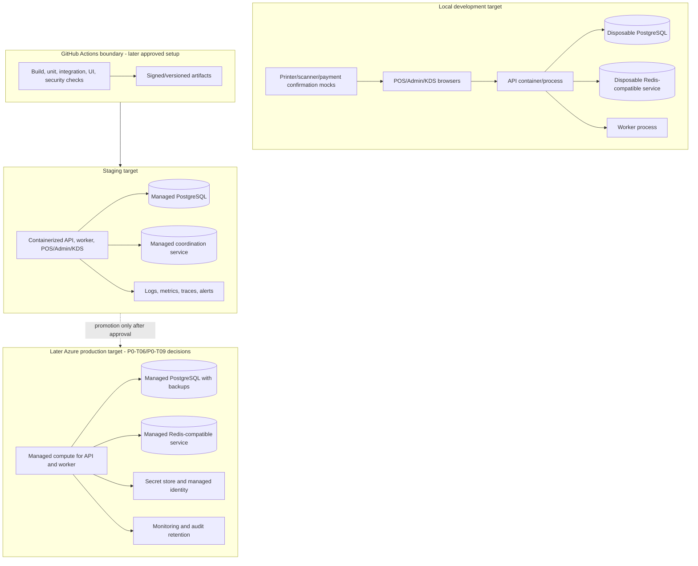
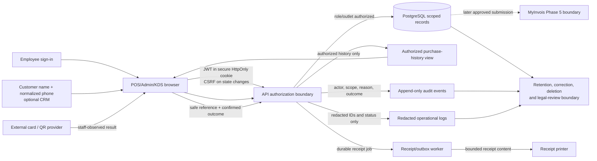

# P0-T05 Architecture and Threat-Model Pack

Status: verified; fresh final-state review `ship`; user approved  
Updated: 18 August 2026  
Scope: Phase 0 planning diagrams and security boundaries only

This pack makes the proposed Coffee POS modular-monolith architecture explicit before application scaffolding. It is a planning contract, not an implementation, migration, deployment, compliance, or production-readiness claim. `PROJECT_PLAN.md`, `docs/PRODUCT_DEFINITION.md`, and `docs/COFFEE_SHOP_USER_WORKFLOWS.md` remain authoritative for scope and behavior. P0-T06 must ratify consequential choices as ADRs before code or schema work begins.

## 1. Decision boundary

- MVP target: one business, one outlet, online-first POS with documented manual fallback.
- Deployable shape: React applications plus one ASP.NET Core modular-monolith API and one background worker.
- Data boundary: PostgreSQL is the system of record; Redis-compatible coordination is a planned supporting service, not a source of truth.
- The POS, Admin, KDS, and Customer Display are separate user-facing surfaces. Customer Display remains deferred unless a later approved task changes the product boundary.
- External card and QR payments are confirmed outside Coffee POS; only safe references and staff-confirmed outcomes enter the system.
- Browser JWTs are planned for secure HttpOnly cookies with CSRF protection; exact rotation, expiry, MFA, and employee-PIN policy remain P0-T06 decisions.
- Every tenant-owned record carries `tenant_id`; outlet-owned records also carry `outlet_id`. Application authorization and PostgreSQL RLS both enforce scope.
- No application modules, database migrations, infrastructure files, dependencies, or provider integrations are created by P0-T05.

## 2. System context

```mermaid
flowchart LR
    cashier[Cashier]
    kitchen[Barista / kitchen]
    manager[Manager]
    owner[Owner]
    pos[POS browser / PWA]
    admin[Admin browser]
    kds[KDS browser]
    cds[Customer Display\n(deferred surface)]
    api[ASP.NET Core modular-monolith API]
    worker[Background worker\noutbox, receipts, reports]
    db[(PostgreSQL\nsystem of record)]
    coord[(Redis-compatible\ncoordination / presence)]
    printer[80 mm ESC/POS printer]
    scanner[HID barcode scanner]
    extpay[External card / QR confirmation\nobserved outside Coffee POS]
    myinvois[MyInvois\nPhase 5 boundary]

    cashier --> pos
    kitchen --> kds
    manager --> admin
    owner --> admin
    pos -->|orders, payments, shifts| api
    admin -->|catalog, reports, controls| api
    kds -->|paid-order queue and status| api
    cds -.->|future approved path| api
    scanner -->|keyboard input| pos
    pos -->|receipt request| api
    api -->|authorized reads/writes| db
    api -->|coordination and reconnect presence| coord
    extpay -->|staff-observed result| pos
    pos -->|safe reference + confirmed outcome| api
    api -->|durable jobs| worker
    worker --> db
    worker -->|receipt output| printer
    worker -->|future submission boundary| myinvois
```

### Context rules

1. The API is the only component allowed to apply business rules or write authoritative business state.
2. Browsers hold view state and client transaction identities; they do not decide that an uncertain payment, sale, stock movement, or KDS update succeeded.
3. The worker consumes committed outbox messages. It must be restartable and idempotent.
4. The printer, scanner, and external payment path can fail independently. Failure is visible and routed to retry or review; it is not converted into success.
5. External payment success is observed outside Coffee POS and entered by staff through the POS; no provider API or settlement integration is assumed for the MVP.
6. MyInvois is a later integration boundary. This pack does not claim eligibility, submission, validation, or reconciliation.

## 3. Container and module architecture

```mermaid
flowchart TB
    subgraph Clients[User-facing clients]
        POS[POS]
        Admin[Admin]
        KDS[KDS]
        CDS[Customer Display\n(deferred)]
    end

    subgraph Host[ASP.NET Core modular-monolith host]
        Contracts[Versioned API and internal event contracts]
        Domain[Domain rules and value definitions]
        App[Application use cases and authorization checks]
        Identity[Identity and access]
        Scope[Tenant / outlet / device scope]
        Catalog[Catalog and pricing]
        Sales[Sales and open tickets]
        Payments[Payments and split tenders]
        Receipts[Receipts]
        Shifts[Shifts and cash ledger]
        Kitchen[Kitchen order workflow]
        Inventory[Inventory, recipes, waste]
        Customers[Customers and purchase history]
        Reporting[Reporting and admin overview]
        Audit[Audit and review records]
        Integrations[External integrations boundary]
        Infra[Infrastructure adapters\nPostgreSQL, Redis, SignalR, printer]
    end

    Worker[Background worker\noutbox and durable jobs]
    DB[(PostgreSQL)]
    Redis[(Redis-compatible service)]

    POS --> Contracts
    Admin --> Contracts
    KDS --> Contracts
    CDS -.-> Contracts
    Contracts --> App
    App --> Domain
    App --> Identity
    App --> Scope
    App --> Catalog
    App --> Sales
    App --> Payments
    App --> Receipts
    App --> Shifts
    App --> Kitchen
    App --> Inventory
    App --> Customers
    App --> Reporting
    App --> Audit
    App --> Integrations
    Identity --> Infra
    Scope --> Infra
    Catalog --> Infra
    Sales --> Infra
    Payments --> Infra
    Receipts --> Infra
    Shifts --> Infra
    Kitchen --> Infra
    Inventory --> Infra
    Customers --> Infra
    Reporting --> Infra
    Audit --> Infra
    Integrations --> Infra
    Infra --> DB
    Infra --> Redis
    Worker --> Infra
    Domain -.->|must not depend on| Infra
```

### Dependency direction

- `Domain` owns business invariants and value definitions and must not reference ASP.NET Core, Entity Framework, SignalR, PostgreSQL, Redis, or browser code.
- `Application` coordinates use cases, authorization, transactions, idempotency, and owned internal contracts.
- Module implementations expose explicit interfaces; infrastructure supplies adapters.
- The host composes modules and transport endpoints. A module must not import another module's persistence internals.
- Clients depend on versioned API contracts, never on server implementation types.
- The worker consumes durable contracts and calls application-owned handlers; it does not bypass authorization or ledger rules.

### Module map

| Module | Primary responsibility | Owned records or concepts | Required boundaries |
|---|---|---|---|
| Identity and access | Sign-in, JWT session, employee PIN, MFA, permissions | Users, employees, roles, permissions, sessions | Secure cookies, CSRF, least privilege, audit failures |
| Tenant/outlet/device scope | Resolve and enforce business context | Tenants, outlets, devices, assignments | `tenant_id` and `outlet_id` checks plus RLS |
| Catalog and pricing | Products, categories, variants, modifiers, availability | Products, categories, modifiers, recipes references | Versioned reads; no silent unavailable-item sale |
| Sales and open tickets | Draft, placed, completed, and pre-completion void outcomes | Orders, order items, discounts, idempotency keys | Immutable completed sale and duplicate-submit protection |
| Payments | Cash, external QR/card references, split tenders | Payment groups and payment tenders | Outstanding-balance rule; no raw card data |
| Receipts | Digital/print representation and retry state | Receipts and delivery attempts | Receipt linked to completed sale and payment result |
| Shifts and cash ledger | Opening, movements, close, variance | Shifts and cash movements | Append-only ledger; manager approval for restricted actions |
| Kitchen workflow | Paid-order intake and preparation status | Kitchen order projection and status events | Only paid orders enter KDS; reconnect and duplicate handling |
| Inventory and recipes | Operational stock projection, deduction, waste, shortage | Stock items, recipes, stock movements | Prevent negative stock by default; audited manager override |
| Customers | Minimal CRM and authorized history | Customer record and access events | Name/normalized phone only; role/outlet scope; no loyalty |
| Reporting/admin | Freshness-aware operational views | Read models and report definitions | Exclude or label pending/review-required data |
| Audit and review | Immutable operational evidence and manual resolution | Audit events, review items | Actor, scope, timestamp, reason, and source reference |
| Integrations | External payment, printer, future MyInvois boundaries | Safe references, delivery jobs, external statuses | Provider failures remain visible and retryable |

## 4. Entity-relationship model

The following is a logical model for review. It is intentionally not a migration or final physical schema.



The logical model treats `ORDER.customer_id` as nullable: an order may complete without a CRM record. Every tenant-owned entity not expanded above (including modifiers, recipes, receipts, kitchen orders, audit events, outbox messages, and idempotency records) carries `tenant_id`; every outlet-owned record also carries `outlet_id`. Employee/outlet and device assignments are authorization inputs, not a bypass around tenant scope.

### Data-model invariants

- All tenant-owned records carry `tenant_id`; outlet-owned records carry `outlet_id` and are checked against the current tenant.
- Completed orders are immutable. Refunds are linked append-only corrections; voids apply only before completion.
- A payment group reaches `Paid` only when accepted tenders cover the outstanding amount. Each tender is separately traceable.
- Payment records never store card number, CVV, PIN, magnetic-stripe data, or payment credentials.
- Stock movements are append-only. Negative stock is rejected by default; an authorized override requires reason, actor, and audit evidence.
- `AUDIT_EVENT`, `OUTBOX_MESSAGE`, and `IDEMPOTENCY_RECORD` preserve evidence and retry safety rather than becoming hidden mutable state.

## 5. Checkout transaction and idempotency flow

```mermaid
sequenceDiagram
    participant POS as POS client
    participant API as API application layer
    participant DB as PostgreSQL transaction
    participant O as Outbox
    participant W as Worker
    participant K as KDS

    POS->>API: Submit order + clientTransactionId + tenders
    API->>API: Authenticate JWT cookie, CSRF, tenant/outlet scope
    API->>DB: Reserve key scoped to tenant/outlet/operation/clientTransactionId
    alt Existing key with matching payload hash
        alt Accepted result
            DB-->>API: Prior sale/payment result
            API-->>POS: duplicate + original result
        else In-progress result
            DB-->>API: Lease/processing state
            API-->>POS: in-progress; retry with same key later
        else Partial, failed, or review-required result
            DB-->>API: Prior non-final outcome
            API-->>POS: prior outcome; explicit resolution or new operation key required
        end
    else Existing key with different payload hash
        DB-->>API: Idempotency conflict
        API-->>POS: reject and review; do not mutate the original request
    else New request
        API->>DB: Atomically insert reservation; lock order/payment group
        API->>DB: Validate totals, permissions, tender outcomes, balance
        alt Balance remains
            API->>DB: Record tender and PartiallyPaid state
            API->>DB: Save idempotency result
            DB-->>API: Commit
            API-->>POS: outstanding balance
        else External payment uncertain or failed
            API->>DB: Record Failed/ReviewRequired outcome
            API->>DB: Save idempotency result
            DB-->>API: Commit
            API-->>POS: review-required result
        else Balance covered
            API->>DB: Record tenders and immutable Completed sale
            API->>DB: Add receipt, audit, stock-intent, and OrderPaid outbox rows
            API->>DB: Save idempotency result
            DB-->>API: Commit atomically
            API-->>POS: paid result and order reference
            W->>O: Claim committed work idempotently
            W->>K: Publish paid-order event
        end
    end
    Note over API,DB: Unique scoped key + payload hash prevents replay and key reuse
    Note over API,DB: Rollback leaves no partial sale/payment/ledger result
```

The idempotency reservation is unique on tenant, outlet, operation, and client transaction identity, and stores a payload hash. A partial split tender uses a separate tender-operation identity under the same payment group; the same key cannot be reused for a different amount or order. The authoritative completion transaction must include all records that define the accepted sale result. Long-running work such as printing, KDS delivery, reporting projection, or MyInvois submission is represented by committed outbox work and never holds the checkout transaction open.

## 6. Transactional outbox and KDS event flow



- The KDS accepts only orders whose authoritative payment state is `Paid`.
- Events contain an immutable event ID, order reference, version, tenant/outlet scope, and source timestamp.
- KDS applies an event once and can rebuild from an API snapshot after reconnect.
- KDS status changes use an authorized, idempotent API command with an expected version; the API validates `New -> Preparing -> Ready -> HandedOff`, outlet scope, actor role, and stale updates before writing.
- Accepted fulfilment changes create an audited `FulfilmentChanged` outbox message consumed by KDS and POS, so POS receives preparation status rather than relying on client-local state.
- `New`, `Preparing`, `Ready`, and `HandedOff` are fulfilment states, not payment states.
- The Order Rail uses `HandedOff` as its terminal fulfilment label; `Completed` remains the immutable sale/order state created by checkout.
- A worker retry, duplicate event, stale version, or reconnect mismatch becomes visible review work rather than a silent overwrite.

## 7. Recipe deduction, stock movement, and manager override



- The MVP stock view is an operational projection, not inventory valuation or COGS.
- A missing recipe, stale catalog, or unavailable ingredient is an explicit exception.
- A manager override cannot erase the shortage or rewrite the completed sale; it adds an attributable movement and audit record.
- Exact recipe rounding, unit conversion, and transaction boundaries are P0-T06/Phase 3 implementation decisions.

## 8. Deployment and environment boundary



Environment rules:

- Local data is disposable and contains no production personal data or secrets.
- CI must build from a clean checkout and run the planned test/security suites; this task does not configure CI.
- Staging and production require separate credentials, scoped database roles, secret management, backups, restore evidence, monitoring, and deployment approval.
- The exact Azure services, topology, retention, and promotion policy remain P0-T06/P0-T09 work.

## 9. Privacy data-flow boundary



### Privacy rules

- Customer data is optional and minimized to display name, normalized phone, authorized purchase history, and audit evidence needed for access control.
- Cashier, manager, and owner history access is role- and outlet-scoped. A duplicate phone is not silently merged.
- Raw payment credentials, passwords, tokens, CVV, PIN, and full card numbers are never stored or logged.
- Logs contain correlation IDs, outcome, scope, and safe references, not unnecessary personal or payment data.
- Purchase history is read through an authorized, outlet-scoped view; the browser never queries another outlet directly.
- Retention classes are explicit even before exact periods are chosen: customer profile/history (privacy review), audit/security evidence (immutable retention), redacted logs (short operational retention), and payment safe references (accounting/provider review).
- Correction, deletion, legal hold, retention periods, and MyInvois handling require P0-T06 decisions and qualified review where applicable; no automatic deletion is claimed.
- Customer export APIs, marketing, loyalty, and unsolicited messaging remain outside the MVP.

## 10. Threat model

The threat model is a planning inventory. It identifies required controls and evidence; it does not claim that any control is implemented or tested.

| ID | Asset / boundary | Threat | Required controls | Planned evidence | Owner |
|---|---|---|---|---|---|
| TM-01 | Refunds, voids, discounts | Cashier or stolen session performs restricted correction | Server-side permission checks, manager approval, reason, immutable source sale, audit event | Permission-abuse and approval tests | P0-T06 / Phase 1 |
| TM-02 | Payment result | QR/card is pending, duplicated, or externally reversed but recorded as paid | Explicit external confirmation, safe reference, `ReviewRequired`, reconciliation view, idempotency | Failure/retry/payment uncertainty tests | P0-T06 / Phase 2 |
| TM-03 | Checkout | Double-click, retry, timeout, or replay creates duplicate sale/payment | Client transaction ID, server idempotency record, unique constraints, prior-result response | Duplicate submit and timeout tests | P0-T06 / Phase 2 |
| TM-04 | Cash ledger | Staff manipulates cash-in/out, change, or shift variance | Append-only movements, role restrictions, counted cash, manager review, audit | Cash variance and authorization tests | P0-T06 / Phase 2 |
| TM-05 | Stock projection | Negative stock or unauthorized adjustment hides shortage | Default rejection, manager override with reason, append-only movement, audit | Concurrency and override tests | P0-T06 / Phase 3 |
| TM-06 | Tenant/outlet data | Crafted request reads or writes another tenant/outlet | Request scope resolution, application checks, PostgreSQL RLS, non-owner runtime role | Two-tenant read/write isolation tests | P0-T05/P0-T06 / Phase 1 |
| TM-07 | KDS events | Missed, duplicated, stale, or replayed event loses kitchen work | Durable outbox, event ID/version, snapshot reconnect, review state | Reconnect and duplicate-event tests | P0-T05/P0-T06 / Phase 3 |
| TM-08 | JWT session | Token theft or cookie misuse grants a long-lived session | Secure HttpOnly/SameSite cookie, expiry/rotation, revocation, MFA for privileged users, audit | Session, expiry, theft-response tests | P0-T06 / Phase 1 |
| TM-09 | State-changing browser requests | Cross-site request changes money or stock | CSRF token/origin checks, same-site policy, server authorization | CSRF and permission-abuse tests | P0-T06 / Phase 1 |
| TM-10 | Logs and diagnostics | Sensitive personal, payment, or token data leaks through logs | Redaction policy, structured safe fields, access controls, retention review | Secret/PII log scan and review | P0-T05/P0-T06 / Phase 1 |
| TM-11 | Customer CRM | Unauthorized purchase-history lookup or silent duplicate merge | Role/outlet scope, normalized lookup, explicit attachment, audit, no automatic merge | Privacy and access tests | P0-T05/P0-T06 / Phase 2/3 |
| TM-12 | Receipt and hardware path | Printer failure or malicious input causes wrong handoff or data exposure | Linked receipt state, retry/review, bounded content, manual fallback, device validation | Printer failure and content tests | P0-T08 / Phase 2/3 |
| TM-13 | Product notes, modifiers, customer names, receipts, logs, CSV exports | Untrusted content causes injection, unsafe printing, log pollution, or spreadsheet formula execution | Length/type validation, output encoding, safe printer charset, log redaction, CSV formula neutralization, content-security review | Malicious-content, receipt, log, and export tests | P0-T06 / Phase 1–3 |
| TM-14 | SignalR/KDS subscription and events | Unauthorized client subscribes to another outlet or receives cross-tenant kitchen events | Authenticated hub connection, tenant/outlet claims, server-side group membership, event filtering, reconnect revalidation, no client-supplied scope | Hub authorization, cross-outlet, reconnect, and event-isolation tests | P0-T06 / Phase 1–3 |

### Security invariants

1. Fixed-precision decimal money only; binary floating point is prohibited.
2. Completed sales are immutable; refunds are append-only linked corrections.
3. Payments, cash, stock, audit, and outbox records are append-only or state-transition controlled.
4. Tenant/outlet scope is enforced in both application code and PostgreSQL RLS.
5. Runtime database roles do not own tables or bypass RLS.
6. State-changing operations require authentication, authorization, validation, CSRF protection where browser applicable, idempotency where replay is possible, and audit evidence.
7. SignalR or equivalent subscriptions are authenticated and filtered by server-resolved tenant/outlet scope.
8. Failed, pending, queued, syncing, stale, and review-required records are never silently counted as completed.

## 11. Verification matrix and residual risk

| Architecture claim to verify later | Evidence required | Planned task |
|---|---|---|
| Module dependency direction is enforced | Architecture test or import-boundary check | P0-T06 / Phase 1 |
| Tenant/outlet isolation works | Two-tenant and cross-outlet authorization tests | P0-T06 / Phase 1 |
| Checkout is atomic and replay-safe | Forced failure, retry, duplicate, and idempotency tests | P0-T06 / Phase 2 |
| Paid orders reach KDS once | Outbox, event version, reconnect, and duplicate-event tests | P0-T06 / Phase 3 |
| Stock cannot silently go negative | Concurrency, shortage, and manager-override tests | P0-T06 / Phase 3 |
| JWT and CSRF controls are effective | Cookie, expiry, CSRF, permission-abuse, and audit tests | P0-T06 / Phase 1 |
| Logs contain no sensitive values | Redaction fixtures and log scan | P0-T06 / Phase 1 |
| Hardware fallback is usable | Device/printer/scanner matrix with actual evidence | P0-T08 |

Residual risks remain for tax/accounting treatment, payment-provider settlement, exact schema and migrations, provider/service selection, Azure topology, hardware compatibility, retention/legal basis, and implementation-level security. These remain open until later approved tasks produce evidence.

## 12. P0-T05 acceptance boundary and non-goals

The P0-T05 review gate required:

- Context, container, module, logical ERD, checkout, outbox/KDS, stock, deployment, privacy, and threat-model views are present.
- Every view labels proposed behavior versus implemented evidence.
- Tenant/outlet scope, payment uncertainty, idempotency, append-only records, KDS reconnect, CSRF, JWT-cookie, and sensitive-logging boundaries are explicit.
- P0-T06 remains the owner of ADRs and final architecture decisions.
- No application code, database migration, dependency, infrastructure configuration, CI workflow, external integration, or production claim is introduced.

Historical baseline note: at the time of this P0-T05 snapshot, this pack did not itself approve Phase 1, P0-T06, P0-T07, P0-T08, or P0-T09. P0-T05 was later accepted; P0-T06 through P0-T09 were subsequently completed and approved under their own task evidence. Phase 1 is now active under P1-T01.
